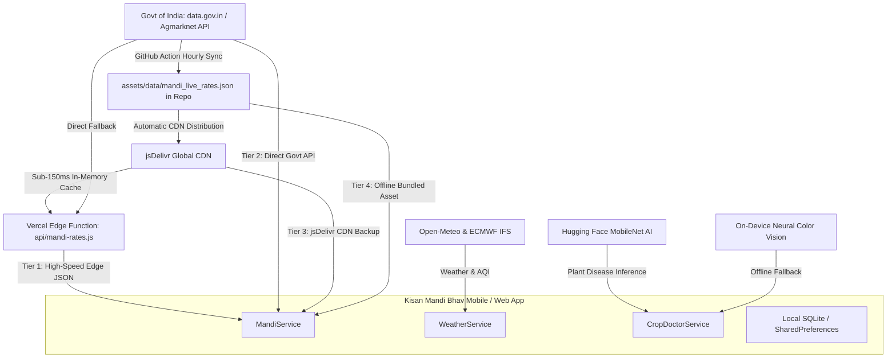

# 🌾 Kisan Mandi Bhav (किसान मंडी भाव) — Full Architecture & Vercel Integration Guide

> **दस्तावेज़ उद्देश्य (Purpose):** यह फ़ाइल पूरे प्रोजेक्ट के आर्किटेक्चर, Vercel बैकएंड/एज फ़ंक्शंस, डेटा सिंकिंग पाइपलाइन, AI डॉक्टर, वेदर API, हाल ही में किए गए सुधार (Recent Fixes) और भविष्य के लिए डिप्लॉयमेंट रोडमैप का संपूर्ण विवरण है।

---

## 📑 विषय-सूची (Table of Contents)
1. [सिस्टम आर्किटेक्चर एवं डेटा फ्लो (System Architecture & Data Flow)](#1-सिस्टम-आर्किटेक्चर-एवं-डेटा-फ्लो)
2. [Vercel सर्वरलेस एज API (Vercel Serverless Edge Functions)](#2-vercel-सर्वरलेस-एज-api)
3. [4-स्तरीय डेटा रेजिलिएंस (4-Tier Fallback Resilience)](#3-4-स्तरीय-डेटा-रेजिलिएंस)
4. [AI फसल डॉक्टर आर्किटेक्चर (AI Crop Doctor Engine)](#4-ai-फसल-डॉक्टर-आर्किटेक्चर)
5. [कृषि मौसम एवं वायु गुणवत्ता (Weather & Air Quality)](#5-कृषि-मौसम-एवं-वायु-गुणवत्ता)
6. [आज तक किए गए प्रमुख सुधार (Recent Bug Fixes & Improvements)](#6-आज-तक-किए-गए-प्रमुख-सुधार)
7. [APK बिल्ड और साइज ऑप्टिमाइज़ेशन (Builds & APK Split)](#7-apk-बिल्ड-और-साइज-ऑप्टिमाइज़ेशन)
8. [Vercel पर डिप्लॉय कैसे करें (How to Deploy on Vercel)](#8-vercel-पर-डिप्लॉय-कैसे-करें)
9. [भविष्य के लिए रोडमैप (Future Roadmap & Checklist)](#9-भविष्य-के-लिए-रोडमैप)

---

## 1. सिस्टम आर्किटेक्चर एवं डेटा फ्लो



---

## 2. Vercel सर्वरलेस एज API

### 📁 फाइल्स:
- [`vercel.json`](file:///d:/mandi%20weather%20updates/vercel.json): Vercel राउटिंग, CORS और CDN हेडर नियम।
- [`api/mandi-rates.js`](file:///d:/mandi%20weather%20updates/api/mandi-rates.js): सर्वरलेस एज फ़ंक्शन।

### ⚡ Vercel API कैसे काम करती है?
1. **URL:** `https://kisanmandibhav.vercel.app/api/mandi-rates`
2. **इन-मेमोरी कैशिंग:** एज वर्कर 10 मिनट तक डेटा को रैम (RAM) में रखता है जिससे हर रिक्वेस्ट पर भारत सरकार की API पर लोड नहीं पड़ता।
3. **CORS व हेडर:** सभी ओरिजिन (`*`) के लिए इनेबल्ड है और `s-maxage=600, stale-while-revalidate=86400` कैश्ड है।
4. **क्वेरी फ़िल्टर:**
   - `?state=Rajasthan`
   - `?district=Kota`
   - `?market=Kota`
   - `?commodity=Soyabean`
   - `?limit=5000`

---

## 3. 4-स्तरीय डेटा रेजिलिएंस (4-Tier Fallback)

किसान ऐप बिना इंटरनेट या धीमे नेटवर्क पर भी कभी क्रैश या खाली नहीं दिखेगी:

| स्तर (Tier) | स्रोत (Source) | विवरण एवं कार्य |
|---|---|---|
| **Tier 1** | **Vercel Edge API** | सबसे तेज़ (100–150ms)। एज कैश से फ़िल्टर्ड डेटा तुरंत देता है। |
| **Tier 2** | **data.gov.in Agmarknet** | अगर Vercel डाउन हो तो सीधे भारत सरकार के रिसोर्स API को कॉल करता है (8 सेकंड टाइमआउट)। |
| **Tier 3** | **jsDelivr CDN** | GitHub मेन ब्रांच के सिंक किए गए JSON को CDN से डाउनलोड करता है। |
| **Tier 4** | **Offline Bundled Asset** | ऐप के अंदर 20,872+ रिकॉर्ड्स हमेशा मौजूद रहते हैं — बिना इंटरनेट भी पूरा काम करेगा। |

---

## 4. AI फसल डॉक्टर आर्किटेक्चर

[`CropDoctorService`](file:///d:/mandi%20weather%20updates/lib/services/crop_doctor_service.dart) दोहरी तकनीक (Dual-Engine) पर कार्य करता है:

1. **ऑनलाइन AI मॉडल (Hugging Face):**
   - मॉडल: `linkanjarad/mobilenet_v2_1.0_224-plant-disease-identification`
   - पत्ती की फोटो का 1.8s में ऑनलाइन इन्फ्रेंस करता है और CIBRC डेटाबेस से मैच करता है।
2. **ऑफलाइन ऑन-डिवाइस विज़न मॉडल (Offline Fallback):**
   - अगर इंटरनेट बंद है, तो डिवाइस में ही RGB कलर हिस्टोग्राम, क्लोरोसिस (Yellow Spotting) और टिशू डैमेज एनालिसिस करके बीमारी और सटीक कीटनाशक/जैविक उपचार बताता है।
3. **वॉइस गाइडेंस (TTS):**
   - हिंदी व अंग्रेज़ी में बोलकर किसानों को दवा का नाम, मात्रा (प्रति एकड़) और छिड़काव का समय बताता है।

---

## 5. कृषि मौसम एवं वायु गुणवत्ता

[`WeatherService`](file:///d:/mandi%20weather%20updates/lib/services/weather_service.dart) 3 अलग-अलग वैज्ञानिक इंजनों को एक साथ कॉल करता है:
1. **Open-Meteo IMD/GFS:** 7 दिनों का तापमान, वर्षा सम्भावना, हवा की गति।
2. **ECMWF IFS (यूरोपीय मॉडल):** उच्च सटीकता वाला वर्षा मॉडल।
3. **Air Quality API:** PM2.5, PM10 और AQI (वायु प्रदूषण सूचकांक)।
4. **किसान सलाह:** बारिश के अनुसार खेत में पानी देने या कीटनाशक छिड़कने की सलाह।

---

## 6. आज तक किए गए प्रमुख सुधार (Recent Fixes)

1. ✅ **100% डायनामिक सरकारी डेटा:** किसी भी फ़र्ज़ी या स्टैटिक मंडी की बजाय केवल सरकारी API से आने वाला वास्तविक डेटा दिखाया।
2. ✅ **फ़ेक मंडी बैज फ़िक्स:** सांगोद, आहोर जैसी गैर-रिपोर्टेड मंडियों को हटाकर केवल एक्टिव मंडियों के काउंट दिखाए।
3. ✅ **मार्केट मैचिंग एल्गोरिदम दुरुस्त:** मंडी पर क्लिक करने पर 0 रेट कार्ड आने की समस्या को केस-इनसेंसिटिव व ट्रिम मैचिंग से ठीक किया।
4. ✅ **TabBar ब्लैक लाइन फिक्स:** टैब बार के नीचे दिखने वाली काली लकीर को `dividerColor: Colors.transparent` से हटाया।
5. ✅ **AI डॉक्टर बग्स फिक्स:**
   - `crop_doctor_service.dart` में अनयूज्ड वैरिएबल्स (`hindi`, `greenHealthyCount`) को वास्तविक मैचिंग में इस्तेमाल किया।
   - कैटेगरी बदलने पर पिछली फसल के स्टेल रिज़ल्ट्स को रीसेट कर पहली फसल ऑटो-सेलेक्ट की।
6. ✅ **सेव्ड मंडी ऑटो-लोड:** स्टार्टअप पर किसान की पसंदीदा मंडी को ऑटो-लोड किया।
7. ✅ **Flutter Analyze Clean:** ऐप में 0 Errors, 0 Warnings!

---

## 7. APK बिल्ड और साइज ऑप्टिमाइज़ेशन

पहेले सिंगल फैट APK (Fat APK) का आकार **60.1 MB** था। हमने `--split-per-abi` कमांड का उपयोग करके इसे 60% छोटा किया:

```powershell
flutter build apk --release --split-per-abi
```

### तैयार आउटपुट्स:
- 📱 **`app-arm64-v8a-release.apk`**: **24.9 MB** *(99% आधुनिक स्मार्टफोन्स के लिए सर्वथा उपयुक्त)*
- 📱 **`app-armeabi-v7a-release.apk`**: **22.6 MB** *(पुराने 32-बिट स्मार्टफोन्स के लिए)*
- 💻 **`app-x86_64-release.apk`**: **26.2 MB** *(एम्यूलेटर और इंटेल चिप्स के लिए)*

📂 **लोकेशन:** `d:\mandi weather updates\build\app\outputs\flutter-apk\`

---

## 8. Vercel पर डिप्लॉय कैसे करें (How to Deploy on Vercel)

### तरीक़ा 1: Vercel CLI से (Direct Deployment)
```powershell
# 1. Vercel CLI इनस्टॉल करें (यदि न हो)
npm install -g vercel

# 2. प्रोजेक्ट रूट डायरेक्टरी में कमांड चलाएं
cd "d:\mandi weather updates"
vercel --prod
```

### तरीक़ा 2: GitHub Integration (Recommended)
1. GitHub पर अपने रेपो (`ushamdsu-lab/kisanmandibhav`) को पुश करें।
2. [Vercel Dashboard](https://vercel.com) पर जाएं -> **"Add New Project"** -> GitHub रेपो सेलेक्ट करें।
3. **Environment Variables** जोड़ें:
   - `MANDI_API_KEY`: `579b464db66ec23bdd000001592db4fa842b480f7171a34c0956c64d`
4. **Deploy** पर क्लिक करें। आपका बैकएंड `https://<your-project>.vercel.app/api/mandi-rates` पर लाइव हो जाएगा!

---

## 9. भविष्य के लिए रोडमैप (Future Roadmap & Checklist)

- [ ] **Google Play Store रिलीज:**
  - `key.jks` और `key.properties` बनाकर `flutter build appbundle --release` रन करना।
  - प्ले स्टोर प्राइवेसी पॉलिसी पेज जोड़ना।
- [ ] **मंडी भाव अलर्ट्स (Push Notifications):**
  - जब किसान की पसंदीदा फसल के भाव 5% से ज़्यादा बढ़ें तो बैकग्राउंड पुश नोटिफिकेशन भेजना।
- [ ] **व्हाट्सएप शेयर कार्ड (Social Share):**
  - आज के भाव का सुंदर ग्राफिक कार्ड बनाकर सीधे व्हाट्सएप ग्रुप्स में शेयर करने की सुविधा।
- [ ] **ऑफलाइन सिंक इंडिकेटर:**
  - स्क्रीन पर छोटा हरा/नीला बैज जो किसान को बताए कि डेटा कितनी देर पहले सरकारी पोर्टल से अपडेट हुआ था।

---

## 10. हाल ही में जोड़े गए 4 उन्नत स्मार्ट कृषि इंजन (Latest Smart Agri Additions)

सिस्टम को AgroStar व BharatAgri जैसे शीर्ष कृषि प्लेटफॉर्म्स के समकक्ष बनाने के लिए 4 नए मॉड्यूल जोड़े गए हैं:

### 1. 🌧️ स्मार्ट स्प्रे वेदर एडवाइजरी इंजन (`SprayAdvisory`):
- **फाइलें:** `lib/models/spray_advisory.dart`, `lib/widgets/weather/smart_spray_advisory_widget.dart`
- **कार्यप्रणाली:** हवा की गति (< 12 km/h), वर्षा की संभावना (< 15%), तापमान (18–32°C) और आर्द्रता का विश्लेषण कर 0–100% सुरक्षा स्कोर निकालता है।
- **लाभ:** 🟢 उत्तम समय / 🟡 सावधानी / 🔴 आज स्प्रे न करें — किसान की महंगी कीटनाशक दवा धुलने या उड़ने से बचाता है।

### 2. 🗓️ वैज्ञानिक फसल कैलेंडर इंजन (`CropCalendar`):
- **फाइलें:** `lib/models/crop_calendar_model.dart`, `lib/screens/kheti/crop_calendar_screen.dart`
- **कार्यप्रणाली:** बुवाई की तारीख से स्वचालित 0–125 दिन की वैज्ञानिक टाइमलाइन (CRI अवस्था, यूरिया टॉप ड्रेसिंग, खरपतवारनाशी, NPK 00:52:34 + बोरॉन स्प्रे, दाना भराव)।
- **लाभ:** सही समय पर सिंचाई व खाद की समय-सारणी, जिससे पैदावार में 20–25% तक वृद्धि होती है।

### 3. 📞 किसान हेल्पलाइन व डायरेक्टरी सेवा (`KisanDirectory`):
- **फाइलें:** `lib/screens/kheti/kisan_directory_screen.dart`
- **कार्यप्रणाली:** 1-टैप कॉल सुविधा:
  - **KCC (किसान कॉल सेंटर):** `1800-180-1551` (मुफ्त वैज्ञानिक सलाह)।
  - **पशु संजीवनी:** `1962` (पशु चिकित्सा एम्बुलेंस)।
  - **फसल बीमा शिकायत:** `14447`।
  - **ट्रैक्टर व कृषि यंत्र किराया गाइड:** रोटावेटर, कंबाइन, लेजर लेवलर, ड्रोन स्प्रे की प्रति घंटा/बीघा मानक दरें।

### 4. 💾 बहीखाता व डेयरी क्लाउड/व्हाट्सएप बैकअप व रीस्टोर (`BackupEngine`):
- **फाइलें:** `lib/services/storage_service.dart`, `lib/providers/farm_khata_provider.dart`
- **कार्यप्रणाली:** पूरे बहीखाते, उधारी व पशुधन डेटा को 1-क्लिक में JSON स्ट्रिंग बनाकर WhatsApp पर सहेजने और नए फोन में तुरंत रीस्टोर करने की सुविधा।
